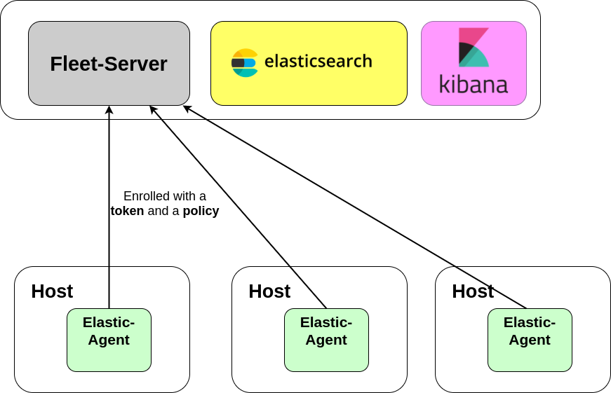
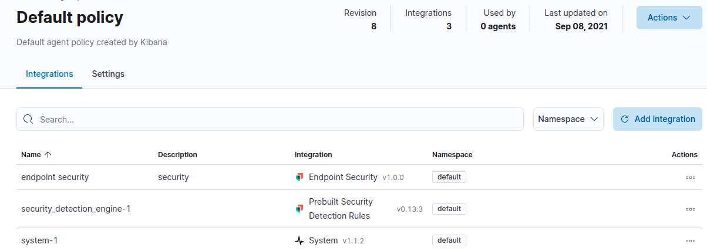
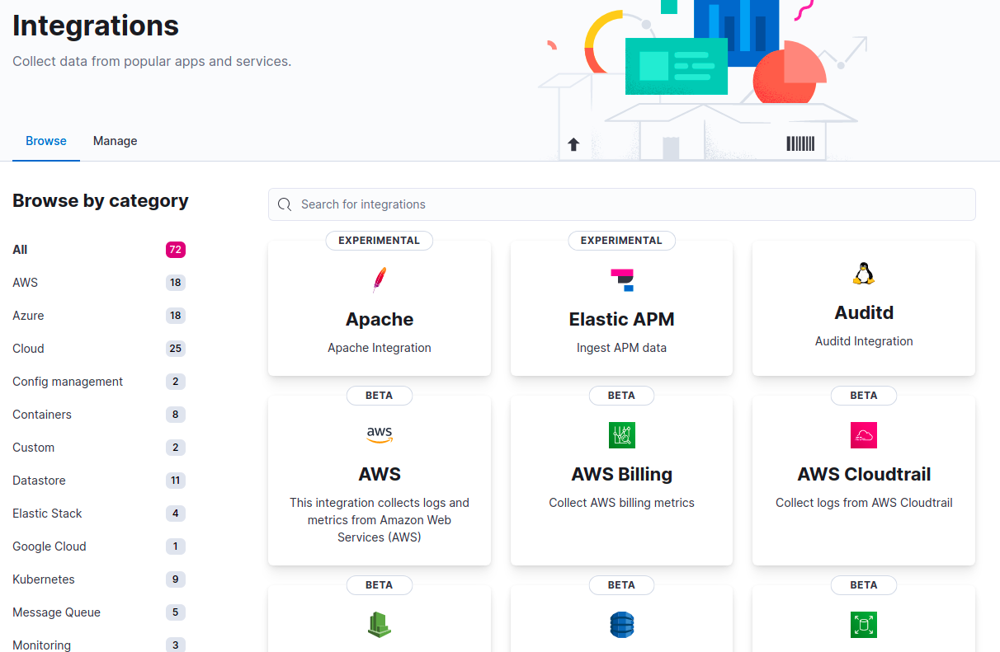
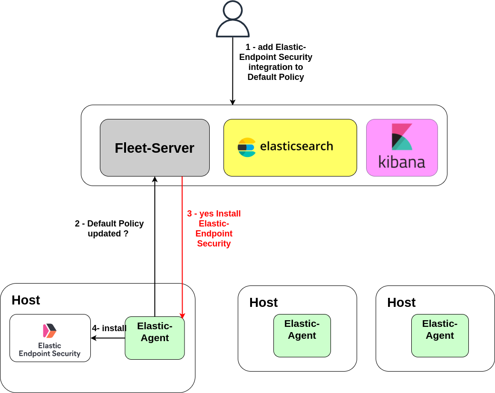
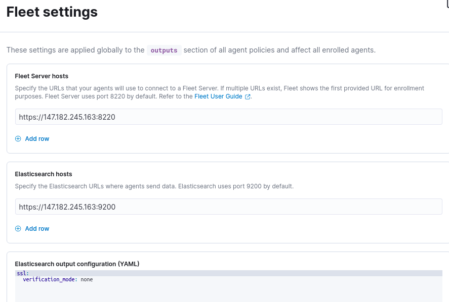
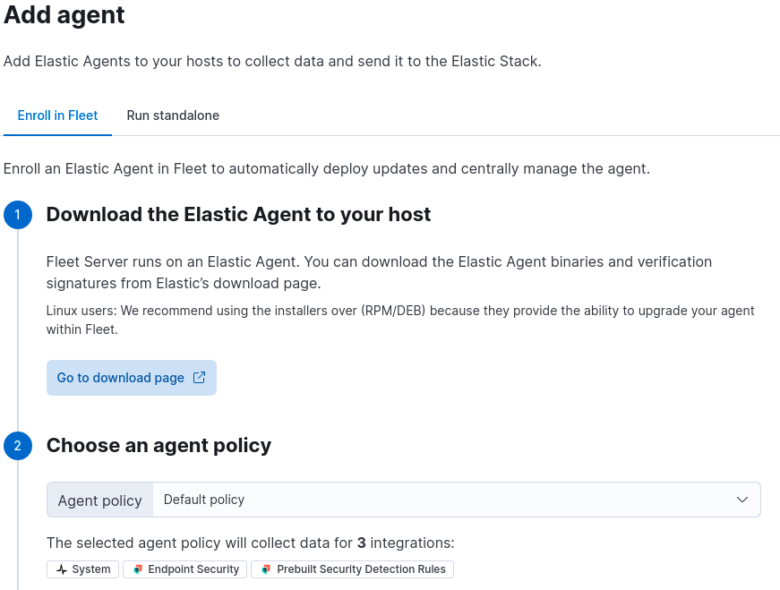
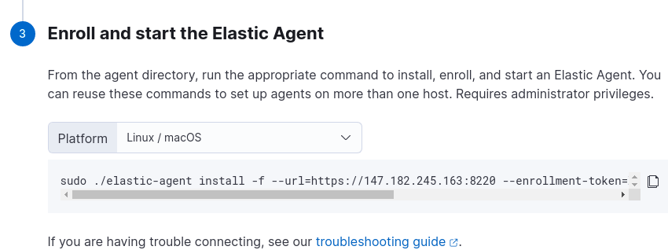

# Intro

This in the **installation guide** for all the components I used during my test : ELK stack deployment with self-signed certificate, Fleet-server and Elastic-agent which are required for Elastic Endpoint Seucurity Installation. There some configuration files examples for Filebeat and MetricBeat. There is Also all the kubernetes ressources necessary for the deployment of the vulnerable wordpress app I used for the tests and Falco deployment. 

All the installation have been tested on Ubuntu 20.0.4 VM with 4GO memory and 80 GO  SSD. 
The VM hosting the ELK stack required more than 4 GO memory (I used a 8 GO memory VM). 

# Summary

- [Deploy ELK stack (elasticsearch + kibana) with Docker and self signed certificate](#deploy-elk-stack--elasticsearch---kibana--with-docker-and-self-signed-certificate)
- [Deploy filebeat on kubernetes as a DaemonSet with autodiscovery enable](#deploy-filebeat-on-kubernetes-as-a-daemonset-with-autodiscovery-enable)
- [Deploy metricbeat on kubernetes as a DaemonSet](#deploy-metricbeat-on-kubernetes-as-a-daemonset)
- [Install Elastic Endpoint Security Agent (local static malware detection + export security related logs)](#install-elastic-endpoint-security-agent--local-static-malware-detection---export-security-related-logs-)
  * [How fleet work ?](#how-fleet-work--)
    + [Architecture](#architecture)
    + [policies](#policies)
  * [installation of fleet-server](#installation-of-fleet-server)
    + [1 - retrieve the CA certificate generated during ELK stack installation into elastic server container](#1---retrieve-the-ca-certificate-generated-during-elk-stack-installation-into-elastic-server-container)
    + [2 - Download the fleet-server](#2---download-the-fleet-server)
    + [3 - Installation](#3---installation)
  * [Installation of fleet-agent as a Debian service on the host](#installation-of-fleet-agent-as-a-debian-service-on-the-host)
    + [Update fleet settings](#update-fleet-settings)
    + [Installation](#installation)
  * [installation of Elastic-endpoint-security](#installation-of-elastic-endpoint-security)
- [Install falco](#install-falco)
  * [Installation](#installation-1)
  * [Falco drivers](#falco-drivers)
- [Install vulnerable wordpress](#install-vulnerable-wordpress)
  * [Install local path provisioner on your kubernetes cluster](#install-local-path-provisioner-on-your-kubernetes-cluster)
  * [Wordpress deployment](#wordpress-deployment)
- [Deployment of other ressources for the tests](#deployment-of-other-ressources-for-the-tests)
  * [Deployment of the same wordpress vulnerable app but in namespace dev and with a service acount with more privileges](#deployment-of-the-same-wordpress-vulnerable-app-but-in-namespace-dev-and-with-a-service-acount-with-more-privileges)
  * [Devops service account](#devops-service-account)
  * [Malicious Pod](#malicious-pod)
  * [Exploit script](#exploit-script)
    + [Script usage](#script-usage)


# Deploy ELK stack (elasticsearch + kibana) with Docker and self signed certificate

The files required for the installation are located in elastic/docker-elk

```bash
cd elastic/docker-elk
```

**Make sure Docker Engine is allotted at least 4GiB of memory**

```bash
docker-compose -f create-certs.yml run --rm create_certs
```

Run docker-compose to bring up the three-node Elasticsearch cluster and Kibana

```bash
docker-compose -f elastic-docker-tls.yml up -d
```

Run the elasticsearch-setup-passwords tool to generate passwords for all built-in users, including the kibana_system user. Do not forget to save those generated in a file to retrieve them easily you will need them to register the different beat agent to Elastic. 

```bash
docker exec es01 /bin/bash -c "bin/elasticsearch-setup-passwords auto --batch --url https://es01:9200"
```

You must configure the kibana_system user password in the compose file to enable Kibana to connect to Elasticsearch, and you’ll need the password for the elastic superuser to log in to Kibana and submit requests to Elasticsearch.

**Set ELASTICSEARCH_PASSWORD in the elastic-docker-tls.yml compose file to the password generated for the kibana_system user**

Use docker-compose to restart the cluster and Kibana

```bash
docker-compose stop
docker-compose -f elastic-docker-tls.yml up -d
```

Open Kibana to load sample data and interact with the cluster: https://localhost:5601

# Deploy filebeat on kubernetes as a DaemonSet with autodiscovery enable 

Go to filebeat/

```bash
cd filebeat
```
Edit the ``filebeat-kubernetes.yaml`` to set the env variable to allow the agent to connect to the elasticsearch cluster. 

```yaml
env:
        - name: ELASTICSEARCH_HOST
          value: ip or host
        - name: ELASTICSEARCH_PORT
          value: "9200"
        - name: ELASTICSEARCH_USERNAME
          value: elastic
        - name: ELASTICSEARCH_PASSWORD
          value: password generated during the elk stack installation
```
make sure the ``configmap``  in the ``filebeat-kubernetes.yaml`` file do not verify the elasticsearch certificate signature because the certificate is self-signed ! 

```yaml
 ssl:
        verification_mode: none
```

```yaml
apiVersion: v1
kind: ConfigMap
metadata:
  name: filebeat-config
  namespace: kube-system
  labels:
    k8s-app: filebeat
data:
  filebeat.yml: |-
    filebeat.inputs:
    
    - type: container
      paths:
        - /var/logs/containers/falco*.log
      processors:
        - add_kubernetes_metadata:
            host: ${NODE_NAME}
            matchers:
            - logs_path:
                logs_path: "/var/log/containers/"

    - type: container
      paths:
        - /var/log/containers/*.log
      processors:
        - add_kubernetes_metadata:
            host: ${NODE_NAME}
            matchers:
            - logs_path:
                logs_path: "/var/log/containers/"

    # To enable hints based autodiscover, remove `filebeat.inputs` configuration and uncomment this:
    #filebeat.autodiscover:
    #  providers:
    #    - type: kubernetes
    #      node: ${NODE_NAME}
    #      hints.enabled: true
    #      hints.default_config:
    #        type: container
    #        paths:
    #          - /var/log/containers/*${data.kubernetes.container.id}.log

    processors:
      - add_cloud_metadata:
      - add_host_metadata:

    cloud.id: ${ELASTIC_CLOUD_ID}
    cloud.auth: ${ELASTIC_CLOUD_AUTH}

    output.elasticsearch:
      hosts: ['https://${ELASTICSEARCH_HOST:elasticsearch}:${ELASTICSEARCH_PORT:9200}']
      username: ${ELASTICSEARCH_USERNAME}
      password: ${ELASTICSEARCH_PASSWORD}
      ssl:
        verification_mode: none

```
# Deploy metricbeat on kubernetes as a DaemonSet

After installation **There is an already Build Dashboard For metribeat** on your Kibanna Dashboard at Home > Obervability > Metrics. 

Go to metricbeat/

```bash
cd metricbeat
```
Edit the ``metricbeat-kubernetes.yaml`` to set the env variable to allow the agent to connect to the elasticsearch cluster. 

```yaml
env:
        - name: ELASTICSEARCH_HOST
          value: ip or hostname
        - name: ELASTICSEARCH_PORT
          value: "9200"
        - name: ELASTICSEARCH_USERNAME
          value: elastic
        - name: ELASTICSEARCH_PASSWORD
          value: password generated during the elk stack installation
```
make sure the ``configmap``  in the ``metribeat-kubernetes.yaml`` file do not verify the elasticsearch certificate signature because the certificate is self-signed !

```yaml
apiVersion: v1
kind: ConfigMap
metadata:
  name: metricbeat-daemonset-config
  namespace: kube-system
  labels:
    k8s-app: metricbeat
data:
  metricbeat.yml: |-
    metricbeat.config.modules:
      # Mounted `metricbeat-daemonset-modules` configmap:
      path: ${path.config}/modules.d/*.yml
      # Reload module configs as they change:
      reload.enabled: false

    metricbeat.autodiscover:
      providers:
        - type: kubernetes
          scope: cluster
          node: ${NODE_NAME}
          unique: true
          templates:
            - config:
                - module: kubernetes
                  hosts: ["kube-state-metrics:8080"]
                  period: 10s
                  add_metadata: true
                  metricsets:
                    - state_node
                    - state_deployment
                    - state_daemonset
                    - state_replicaset
                    - state_pod
                    - state_container
                    - state_cronjob
                    - state_resourcequota
                    - state_statefulset
                    - state_service
                - module: kubernetes
                  metricsets:
                    - apiserver
                  hosts: ["https://${KUBERNETES_SERVICE_HOST}:${KUBERNETES_SERVICE_PORT}"]
                  bearer_token_file: /var/run/secrets/kubernetes.io/serviceaccount/token
                  ssl.certificate_authorities:
                    - /var/run/secrets/kubernetes.io/serviceaccount/ca.crt
                  period: 30s
                # Uncomment this to get k8s events:
                #- module: kubernetes
                #  metricsets:
                #    - event
        # To enable hints based autodiscover uncomment this:
        #- type: kubernetes
        #  node: ${NODE_NAME}
        #  hints.enabled: true

    processors:
      - add_cloud_metadata:

    cloud.id: ${ELASTIC_CLOUD_ID}
    cloud.auth: ${ELASTIC_CLOUD_AUTH}

    output.elasticsearch:
      hosts: ['https://${ELASTICSEARCH_HOST:elasticsearch}:${ELASTICSEARCH_PORT:9200}']
      username: ${ELASTICSEARCH_USERNAME}
      password: ${ELASTICSEARCH_PASSWORD}
      ssl:
        verification_mode: none
```


# Install Elastic Endpoint Security Agent (local static malware detection + export security related logs)


Elastic Endpoint Security is installed directly on the host. The agent is more difficult to install than other agents. Indeed, it can only be installed through the ```fleet-server``. ``fleet`` is the new Elastic way to install their agents on hosts. Fleet is usefull when you have to install Elastic beats and agents to a fleet of hosts, it can in one click only install a beat agent (elastic-endpoint-security, metricbeat, filebeat, etc..) to a whole fleet of hosts.

## How fleet work ? 

### Architecture

Fleet needs two components : ``fleet server`` (usually installed on the same host as elk stack) and ``Elastic-Agent`` installed on the different hosts where you want to install the ``beats``.

You install the ``fleet-agent`` to a host and register it to the ``fleet-server`` with a token. You can then in your Kibana Dashboard deploy an agent in a few click and it will be deployed on all the hosts registered to the ``fleet-server``. It's very conveniant when there is a lot of hosts + it allows you to update the configuration files of the agents (by example metricbeat configuration file) on all the hosts from the Kibana Dashboard. It's a centralized way for managing beat agents (their configuration, etc...). This installation process works only for agent installed on the host (No kubernetes agent installation) 

Architecture schema



Note that ``elastic-agent`` works in **pull-mode**. It regularly checks the ``fleet-server`` for changing state if it sees a new agent has to be deployed, it will automatically download and install the agent, same when an agent's configuration file is updated. You can also push Elastic-Endpoint-security rules to all the registered hosts with this.  

Official docs here [https://www.elastic.co/guide/en/fleet/7.15/fleet-server.html](https://www.elastic.co/guide/en/fleet/7.15/fleet-server.html)


### policies 

Default policy with Elastic **Endpoint Security integration** add to it


When you register a host during ``elastic-agent`` installation, you enroll it with a toekn AND  a **policy** (default policy if no policy selected). You can update policies by adding an ``integration`` (which are agents collecting data like beats or third party software integration : see the image below with all the integrations avalaible) or **update the configuration files** attached to this policy. All the hosts registered with the this **policy** will be affected by the modification. 

All integration avalaible (you can browse them on your Kibana Dashboard : Mome > Management > integrations)


Fleet policy updated schema



## installation of fleet-server

### 1 - retrieve the CA certificate generated during ELK stack installation into elastic server container 

During **fleet-server** installation it will need to connect to your **elastic server**, as it communicates through **HTTPS** protocol, fleet-server has to verifiy that the elastic server certificate has been signed by a **trusted certificate authority**. Unfortunately there is no option to disable the **SSL verification** during the installation so you will have to **retrieve** the ``ca certificate`` generated during your ELK stack installation that was used to sign the certificate

On the **host where ELK stack has been installed** via Docker. 

```bash
docker cp es01:/usr/share/elasticsearch/config/certificates/ca/ca.crt . 
```

### 2 - Download the fleet-server

For **Linux system** :

```bash
wget https://artifacts.elastic.co/downloads/beats/elastic-agent/elastic-agent-7.14.0-linux-x86_64.tar.gz
tar -xf elastic-agent-7.14.0-linux-x86_64.tar.gz
cd elastic-agent-7.14.0-linux-x86_64
```
Download page for different OS.
[https://www.elastic.co/fr/downloads/past-releases/elastic-agent-7-14-0](https://www.elastic.co/fr/downloads/past-releases/elastic-agent-7-14-0)

### 3 - Installation

<ol>
<li>Log in to Kibana and go to Management > Fleet. The first time you visit this page, it might take a minute to load.</li>
<li>Click Fleet settings, and in the Fleet Server hosts field, specify the URLs Elastic Agents will use to connect to Fleet Server. For example, https://192.0.2.1:8220, where 192.0.2.1 is the host IP where you will install Fleet Server.</li>
<li>In the Elasticsearch hosts field, specify the Elasticsearch URLs where Elastic Agents will send data. For example, https://192.0.2.0:9200 where 192.0.2.1 is the host IP where Elasticsearch server is installed. For more information about these settings, see Fleet UI settings [https://www.elastic.co/guide/en/fleet/7.15/fleet-settings.html](fleet UI settings).</li>
<li>Save and apply the settings</li>
<li>Click the Agents tab and follow the in-product instructions to add a Fleet server</li>
</ol>

After generating the service token, save it to a secure location. You might want to use this token later to scale your deployment by adding Fleet Servers. For other ways to generate service tokens, see [https://www.elastic.co/guide/en/elasticsearch/reference/7.15/service-tokens-command.html](elasticsearch-service-tokens).

**ATTENTION : For self-signed certificate elastic installation :**

**Be carefull when following fleet UI instructions at step ``3 - Start Fleet Server`` the command they give you won't work out of the box because of the self signed certificate (I lost a lot of time debugging this). Add ``--fleet-server-es-ca=path`` where ``path`` is the path where you stored the retrieved ca certifiate of your elasticearch server at step 1 (see example below)**

**full command example : subsitute fleet server ip, path to the ca certificate, fleet-service-token and fleet-server-policy with your own values**

```bash
./elastic-agent install  -f  --fleet-server-es=https://IP_FLEET_SERVER_HOST:9200 --fleet-server-es-ca=/home/elastic/fleet-server/ca.crt --fleet-server-service-token=3775d2c0-101c-11ec-87b4-3f62f2b5a449  --fleet-server-policy=3775d2c0-101c-11ec-87b4-3f62f2b5a449
```


## Installation of fleet-agent as a Debian service on the host

Now that the fleet server is installed you have to install the second component on hosts which is the ``fleet-agent``, it regularly checks the fleet server for updated policies are new ``integration`` (agents) to be installed on the host.  


### Update fleet settings

On Kibana Dashboard : Home > Management > Fleet and on **top right corner** fleet settings 



```yaml
ssl :
  verification mode: none
```
This will be added to all ``integrations`` (agents) configuration file, like this they can send logs to Elastic without verifying the self-signed certificate. 

### Installation

To install the elastic agent, go to your **Kibana Dashboard at Home > Management > Fleet > Add Agent**
and follow the instructions it will tell you the commands to execute on the host where you want to install ``elastic-agent``



```bash
wget https://artifacts.elastic.co/downloads/beats/elastic-agent/elastic-agent-7.14.0-linux-x86_64.tar.gz
tar -xf elastic-agent-7.14.0-linux-x86_64.tar.gz
cd elastic-agent-7.14.0-linux-x86_64
```

**BE CAREFULL add the  ``--insecure`` flag to the command in the instruction to not verify the self-signed Fleet server certificate like in the example below**

```bash
sudo ./elastic-agent install -f --insecure --url=https://IP_WHERE_FLEET_SERVER_IS_INSTALLED:8220 --enrollment-token=token
```

## installation of Elastic-endpoint-security

Now that the ``fleet-server`` is installed and the ``elastic-agent`` is installed on all the necessary hosts too, we can finally add ``Elastic Endpoint Security`` integration directly from Kibana Dashboard Home > Management > Fleet > agent policies > default policy > add integration > security > Elastic-Endpoint security > Add Elastic-Enpoint security

Elastic Endpoint Security will be deployed on all the hosts where ``elastic-agent`` is installed and enrolled with ``default policy``. It will starts pushing logs to Elastic as soon as the installation is finished. 


# Install falco
 
I installed ``Falco`` via ``helm``. 

You can Install **Helm** at [https://helm.sh/docs/intro/install/](https://helm.sh/docs/intro/install/). 
By default Helm interacts with your Kubernetes Api server with the admin Config file located at ``/home/user/.kube/config`` to have full access to the cluster. Some installation like k3s do not store the admin Config file at this location so you will have to copy it to this location or specify its path in ``helm`` commands with the flag ``--kubeconfig path_where_to_config``. By example : ``helm --kubeconfig /etc/rancher/k3s/k3s.yaml ls --all-namespaces``

## Installation 

```bash
helm repo add falcosecurity https://falcosecurity.github.io/charts
helm repo update
helm install falco --set falco.jsonOutput=true --set falco.jsonIncludeOutputProperty=true falcosecurity/falco
```
JsonOutput and jsonIcludeOutputProperty for easier integration with ``Filebeat`` that will automatically discover falco containers, retrieves and ships the Falco logs to Elastic.

## Falco drivers

*Falco needs a driver (the falco kernel module or the eBPF probe : [https://falco.org/docs/event-sources/drivers/#kernel-module](https://falco.org/docs/event-sources/drivers/#kernel-module) ) to work.
The container image includes a script (falco-driver-loader) that either tries to build the driver on-the-fly or downloads a prebuilt driver as a fallback. Usually, no action is required.
If a prebuilt driver is not available for your distribution/kernel, Falco needs kernel headers installed on the host as a prerequisite to building the driver on the fly correctly. You can find instructions on installing the kernel headers for your system under the [install section](https://falco.org/docs/getting-started/installation/) of the official documentation.*

# Install vulnerable wordpress

My installation use a persistent volume provisioner to create the wordpress and mysql persistent volume. It's a controller that watchs for PersistentVolumeClaim and automatically create an associated PersistentVolume on the host where the pod is deployed : k3s distribution come with one pre-installed : local-path-provisioner. [local-path-provisioner](https://github.com/rancher/local-path-provisioner)

## Install local path provisioner on your kubernetes cluster

Source code at [local-path-provisioner](https://github.com/rancher/local-path-provisioner)

In this setup, the directory /opt/local-path-provisioner will be used across all the nodes as the path for provisioning (a.k.a, store the persistent volume data). The provisioner will be installed in local-path-storage namespace by default.

```bash
kubectl apply -f https://raw.githubusercontent.com/rancher/local-path-provisioner/master/deploy/local-path-storage.yaml
```

After installation, you should see something like the following:

```bash
$ kubectl -n local-path-storage get pod
NAME                                     READY     STATUS    RESTARTS   AGE
local-path-provisioner-d744ccf98-xfcbk   1/1       Running   0          7m
```
## Wordpress deployment

All images used for Pods are stored in my public Docker images repository [paulborielabs](https://hub.docker.com/u/paulborielabs). You can re-build them from source :

`paulborielabs/wordpress:gare` can be rebuilt with Dockerfile at `docker/images/wordpress/`
`paulborielabs/wp-cli:v4` can be rebuilt with Dockerfile at `docker/images/wp-cli/wp-cli/`
`paulborielabs/wp-cli:nodeport` can be rebuilt with Dockerfile at `docker/images/wp-cli/wp-cli-nodeport/`


Go to ``vulnerable-wordpress/red-ns/``

There are 3 different wordpress folder
<ol>
<li>kubernetes: which is the one exposing Kubernetes through Nginx Ingress Controller which is the default Ingress Controller in most Kubernetes distribution </li>
<li>kubernetes-k3s : which is the one exposing kubernetes through Traefik Ingress Controller (which is the default ingress controller in k3s</li>
<li>kubernetes-nodeport : which is the one exposing Wordpress through nodeport which in independant of the Ingress Controller. This one will work right out-of-the-box in any Kubernetes distribution </li>
</ol>

Choose one according to your Kubernetes distribution and exececute the following commands, the ressources will be created in the ``red-ns`` namespace: 

```bash
cd vulnerable-wordpress/red-ns/kubernetes
kubectl apply -f red-ns.yaml
kubectl apply -f .
```
Pods will take about 30 seconds to be up.

You can verify your installation, you should see something like this

```bash
kubectl -n red-ns get pods
NAME                         READY   STATUS    RESTARTS   AGE
mysql-c65957f85-nst95        1/1     Running   0          19h
wordpress-66cd544579-cv29k   2/2     Running   0          19h
```

If you deploy it through ``nodeport`` you shloud be able to access the wordpress app [http://$NODE_IP:30050](http://$NODE_IP:30050). If you deploy it through ``nginx`` or ``traefik`` then you shoud be able to access it with port 80. 


# Deployment of other ressources for the tests

## Deployment of the same wordpress vulnerable app but in namespace dev and with a service acount with more privileges


```bash
cd vulnerable-wordpress/dev/kubernetes
kubectl apply -f dev.yaml
kubectl apply -f .
```
Check your installation

```bash
root@elastic:~# kubectl get pods -n dev
NAME                         READY   STATUS        RESTARTS   AGE
mysql-c65957f85-xm58d        1/1     Terminating   0          8d
wordpress-7d8bc78554-nlbzj   2/2     Terminating   0          8d
```
The application is not exposed outside the cluster. 


## Devops service account

During test phase I used a Devops Service account in dev namespace to escalate privileges, the yaml ressources files are at `vulnerable-wordpress/dev/devops-serviceaccount/`. 

```bash
cd vulnerable-wordpress/dev/devops-serviceaccount/
kubectl apply -f . 
```
## Malicious Pod

During test phase I also used a malicious Pod that mounts the whole host file system from its `/` into the Pod. 
The pod yaml ressource is at `vulnerable-wordpress/malicious-pod/evil.yaml`

## Exploit script

This is the exploit script to exploit the vulnerability of the ``wordpress file upload`` plugin (version < 4.13.0, CVE-2020-10564 ). The upload form is located at http://localhost:30050/2021/09/13/hack-me-if-you-can/ and you can from there upload a reverse shell by uploading it at another location than the default location of the plugin thanks to a Remote File Inclusion vulnerability (../plugins/wp-file-upload/lib/)

The vulnerability report : [https://wpscan.com/vulnerability/10132](https://wpscan.com/vulnerability/10132).

Manual exploitation with **Burpsuite** [here](https://github.com/beerpwn/CVE/blob/master/WP-File-Upload_disclosure_report/report.md).


### Script usage

```bash
borie@pgp-branche: cd vulnerable-wordpress/exploit/
borie@pgp-branche:~/exploit$ python exploit.py http://142.93.65.231/2021/09/13/hack-me-if-you-can/ / 
[+] admin-ajax.php: http://142.93.65.231//wp-admin/admin-ajax.php
[+] admin-ajax.php should be fine, keep testing
[+] Plugin url: http://142.93.65.231/2021/09/13/hack-me-if-you-can/
[+] Using payload: ../plugins/wp-file-upload/lib/RcE-for-Th3-WiN.txt
[+] Retrived nonce parameter: 3b875bc68c
[+] Retrived params_index parameter: rmFyb4RaMMeWm1WF
[+] Retrived session_token parameter: 13518963866140a598f2ff89.40189050
[+] Stage 1 success
[+] Stage 2 work fine
[+] Stage 3 work prefectly :)
[+] We should have our webshell, gonna check it!
www-data

$ whoami
www-data
```
You might need ``urlparse2`` library and ``requests`` library to execute the python script. 
